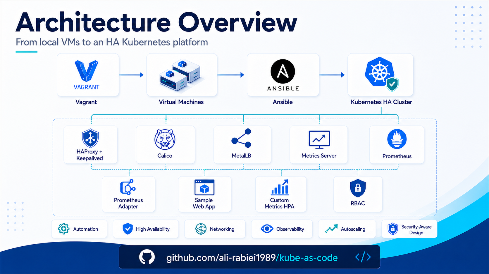

<p align="center">
  
</p>

# Architecture

> This document describes the Vagrant-based Kubernetes HA lab architecture and the current implementation choices.


## 1. Purpose

This project provisions a Vagrant-based Kubernetes lab that demonstrates a production-inspired Kubernetes architecture using Ansible automation. The environment includes a highly available Kubernetes control plane, separated management and workload networks, a CNI plugin, LoadBalancer support for bare-metal style service exposure, a Helm-deployed sample application, limited RBAC access, and a custom-metrics autoscaling pipeline.

The design is intentionally built as a lab, but the structure follows enterprise-oriented patterns:

- repeatable infrastructure provisioning with Vagrant;
- configuration management and cluster bootstrap with Ansible;
- highly available Kubernetes API access through HAProxy and Keepalived;
- separate management/control-plane and workload/data-plane networks;
- Helm-based application deployment;
- RBAC-based least-privilege access;
- metrics collection and custom-metric-based HPA using Prometheus and Prometheus Adapter.

---

## 2. High-Level Architecture

```text
+-----------------------------+
|        Operator Host        |
|  Vagrant + Ansible + Helm    |
+--------------+--------------+
               |
               | SSH / Ansible
               | Management Network: 192.168.100.0/24
               v
+-----------------------------------------------------------------------+
|                         Kubernetes HA Lab                             |
|                                                                       |
|  +----------------+   +----------------+   +----------------+         |
|  | k8s-master-1   |   | k8s-master-2   |   | k8s-master-3   |         |
|  | Control Plane  |   | Control Plane  |   | Control Plane  |         |
|  | HAProxy        |   | HAProxy        |   | HAProxy        |         |
|  | Keepalived     |   | Keepalived     |   | Keepalived     |         |
|  | etcd member    |   | etcd member    |   | etcd member    |         |
|  +-------+--------+   +-------+--------+   +-------+--------+         |
|          |                    |                    |                  |
|          +---------- API VIP: 192.168.100.10:8443 ----------------+   |
|                                                                       |
|  +----------------+                         +----------------+        |
|  | k8s-worker-1   |                         | k8s-worker-2   |        |
|  | Worker Node    |                         | Worker Node    |        |
|  +----------------+                         +----------------+        |
|                                                                       |
|  Pod Network:      10.244.0.0/16                                      |
|  Service Network:  10.96.0.0/12                                       |
|  Workload Network: 192.168.200.0/24                                   |
+-----------------------------------------------------------------------+
               |
               | Application LoadBalancer IP
               | MetalLB pool: 192.168.200.240-192.168.200.250
               v
+-----------------------------+
|         Sample App          |
|  http://192.168.200.240     |
+-----------------------------+
```

---

## 3. VM Topology

The cluster is built with five virtual machines:

| Node | Role | Management IP | Workload IP | vCPU | Memory |
|---|---|---:|---:|---:|---:|
| `k8s-master-1` | Control plane, HAProxy, Keepalived, etcd | `192.168.100.11` | `192.168.200.11` | 2 | 2048 MB |
| `k8s-master-2` | Control plane, HAProxy, Keepalived, etcd | `192.168.100.12` | `192.168.200.12` | 2 | 2048 MB |
| `k8s-master-3` | Control plane, HAProxy, Keepalived, etcd | `192.168.100.13` | `192.168.200.13` | 2 | 2048 MB |
| `k8s-worker-1` | Worker | `192.168.100.21` | `192.168.200.21` | 2 | 2048 MB |
| `k8s-worker-2` | Worker | `192.168.100.22` | `192.168.200.22` | 2 | 2048 MB |

The default VM sizing is intentionally small because this is a laptop-friendly Vagrant lab. The values can be overridden through environment variables in the `Vagrantfile`.

Example:

```bash
MASTER_MEMORY=2048 WORKER_MEMORY=2048 vagrant up --provider=libvirt
```

---

## 4. Virtualization and OS Choice

The default guest operating system is:

```text
K8S_BOX=generic/ubuntu2204
```

The `Vagrantfile` supports both `libvirt` and `virtualbox` providers. The primary target for this lab is `libvirt/KVM`, but provider-specific blocks are included so the same topology can be used with VirtualBox when the host supports it.

The box can be changed without editing the `Vagrantfile`:

```bash
K8S_BOX=<box-name> vagrant up --provider=<provider>
```

This makes the lab more portable, although full portability still depends on the chosen Vagrant box having compatible networking, cloud-init behavior, package repositories, and kernel support.

---

## 5. Network Architecture

The design uses separate networks for management/control-plane traffic and workload/application traffic.

| Network | CIDR | Purpose |
|---|---:|---|
| Vagrant NAT | Provider-managed | Initial SSH bootstrap and outbound internet access |
| Management network | `192.168.100.0/24` | SSH, Ansible, Kubernetes API, HAProxy, Keepalived, etcd, kubelet management |
| Workload network | `192.168.200.0/24` | CNI node-to-node traffic, application exposure, MetalLB LoadBalancer IPs |
| Pod network | `10.244.0.0/16` | Kubernetes Pod IP allocation through Calico |
| Service network | `10.96.0.0/12` | Kubernetes ClusterIP Service allocation |

### Design rationale

- The management network is reserved for administrative and control-plane communication.
- The workload network is used for application/data-plane traffic.
- MetalLB allocates LoadBalancer IPs from the workload network, not from the management network.
- Calico uses the workload network for node IP autodetection.

This keeps user/application traffic separate from administrative traffic, which is a better approximation of an enterprise network design.

---

## 6. Kubernetes API High Availability

Each control-plane node runs:

- `kube-apiserver` on port `6443`;
- HAProxy listening on port `8443`;
- Keepalived providing the virtual IP `192.168.100.10`.

The Kubernetes API endpoint used by kubeadm and clients is:

```text
192.168.100.10:8443
```

The request flow is:

```text
kubectl / kubelet / kubeadm
        |
        v
192.168.100.10:8443  (Keepalived VIP)
        |
        v
HAProxy on active control-plane node
        |
        +--> k8s-master-1:6443
        +--> k8s-master-2:6443
        +--> k8s-master-3:6443
```

### Why HAProxy and Keepalived are installed on the masters

For this lab, HAProxy and Keepalived run directly on all control-plane nodes. This avoids the need for additional load balancer VMs and keeps the Vagrant environment compact.

In production, a dedicated external load balancer, cloud load balancer, or pair of dedicated load-balancer nodes is usually preferred. Running the load balancer on the control-plane nodes is acceptable for a lab, but it couples API load-balancing availability to the control-plane nodes themselves.

---

## 7. Kubernetes Bootstrap Architecture

The cluster is bootstrapped with `kubeadm` and managed by Ansible roles.

The high-level bootstrap sequence is:

```text
1. Prepare all nodes
   - disable swap
   - configure kernel modules and sysctl
   - install base packages

2. Install container runtime
   - containerd
   - systemd cgroup driver

3. Install Kubernetes components
   - kubeadm
   - kubelet
   - kubectl

4. Configure Kubernetes API high availability
   - HAProxy
   - Keepalived
   - API VIP

5. Initialize the first control-plane node

6. Join remaining control-plane nodes

7. Join worker nodes

8. Install Calico CNI

9. Install cluster add-ons and application components
```

Kubernetes version:

```text
v1.36.1
```

Container runtime:

```text
containerd
```

---

## 8. CNI Design

Calico is used as the Kubernetes CNI plugin.

Key settings:

| Setting | Value |
|---|---:|
| Calico version | `v3.32.0` |
| Pod CIDR | `10.244.0.0/16` |
| Encapsulation | `VXLAN` |
| BGP | Disabled |
| NAT outgoing | Enabled |
| Node IP autodetection CIDR | `192.168.200.0/24` |

### Why Calico

Calico is widely used in enterprise Kubernetes environments and supports both networking and network policy enforcement. VXLAN mode keeps the lab simple because it does not require BGP peering with the underlying network.

### Production note

In production, the CNI design should be selected based on routing requirements, network policy requirements, observability requirements, and the underlying data center network model. BGP mode can be considered when the physical network is designed to support routed Kubernetes Pod networking.

---

## 9. LoadBalancer Design with MetalLB

MetalLB provides `LoadBalancer` service support in this non-cloud Vagrant environment.

Key settings:

| Setting | Value |
|---|---:|
| Namespace | `metallb-system` |
| Mode | Layer 2 |
| Address pool | `192.168.200.240-192.168.200.250` |
| Network | Workload network |

MetalLB allocates application-facing IPs from the workload network. The sample application uses:

```text
192.168.200.240
```

The traffic path is:

```text
Client / Host
   |
   v
192.168.200.240:80  (MetalLB LoadBalancer IP)
   |
   v
Kubernetes Service: k8s-lab-sample-webapp
   |
   v
Nginx Pods
```

### Why workload network is used for MetalLB

The LoadBalancer IP is part of application exposure, so it belongs to the workload/data-plane network. The management network should not be used for public or user-facing application traffic.

---

## 10. Sample Application Architecture

The sample application is deployed with Helm into the `demo` namespace.

Helm release naming is intentionally kept clear:

| Item | Value |
|---|---|
| Chart name | `sample-webapp` |
| Helm release name | `k8s-lab` |
| Main workload/service name | `k8s-lab-sample-webapp` |
| Metrics service name | `k8s-lab-sample-webapp-metrics` |

The release name is not the same as the chart name. This avoids duplicated resource names such as `sample-webapp-sample-webapp` while still following the standard Helm naming pattern:

```text
<release-name>-<chart-name>
```

The application Pod contains two containers:

| Container | Purpose | Port |
|---|---|---:|
| `nginx` | Serves the sample web application and health endpoints | `80` |
| `nginx-exporter` | Exposes Nginx metrics in Prometheus format | `9113` |

The application exposes:

| Endpoint | Purpose | Exposure |
|---|---|---|
| `/` | Main web page | Public through MetalLB |
| `/healthz` | Liveness endpoint | Public through MetalLB |
| `/readyz` | Readiness endpoint | Public through MetalLB |
| `/metrics` | Nginx exporter metrics | Internal ClusterIP only |

The application uses two Services:

| Service | Type | Purpose |
|---|---|---|
| `k8s-lab-sample-webapp` | LoadBalancer | User/application traffic |
| `k8s-lab-sample-webapp-metrics` | ClusterIP | Internal Prometheus scraping |

### Metrics exposure model

The metrics endpoint is intentionally not exposed through the public LoadBalancer. Prometheus scrapes the internal metrics Service instead:

```text
Nginx stub_status on 127.0.0.1:8080/stub_status
   |
   v
nginx-prometheus-exporter sidecar
   |
   v
k8s-lab-sample-webapp-metrics.demo.svc.cluster.local:9113/metrics
   |
   v
Prometheus
```

This keeps operational metrics internal to the cluster.

---

## 11. Observability and Autoscaling Architecture

The lab uses three different metrics components, each with a different role.

| Component | Purpose |
|---|---|
| Metrics Server | Provides CPU and memory metrics through `metrics.k8s.io` |
| Prometheus | Scrapes and stores application/exporter metrics |
| Prometheus Adapter | Exposes Prometheus metrics through `custom.metrics.k8s.io` for HPA |

### Metrics Server flow

```text
kubectl top / CPU-memory based HPA
   |
   v
metrics.k8s.io
   |
   v
Metrics Server
   |
   v
kubelet / cAdvisor
```

### Custom metrics flow

```text
Nginx
   |
   v
nginx-prometheus-exporter
   |
   v
Prometheus
   |
   v
Prometheus Adapter
   |
   v
custom.metrics.k8s.io
   |
   v
HorizontalPodAutoscaler
```

The custom metric exposed to Kubernetes is:

```text
nginx_http_requests_per_second
```

It is derived from the Prometheus counter:

```text
nginx_http_requests_total
```

using a PromQL rate expression similar to:

```promql
sum(rate(nginx_http_requests_total{namespace="demo",service="k8s-lab-sample-webapp"}[2m])) by (namespace, service)
```

The HPA scales the Deployment based on the custom metric attached to the application Service.

The HPA uses an Object metric because the request-rate metric is associated with the application Service rather than individual Pods:

| HPA field | Value |
|---|---|
| Target Deployment | `k8s-lab-sample-webapp` |
| Described object | Service `k8s-lab-sample-webapp` |
| Metric | `nginx_http_requests_per_second` |
| Target type | `AverageValue` |
| Lab target | `500m` requests/second per replica-equivalent |
| Min replicas | `3` |
| Max replicas | `8` |

The lab configuration uses faster feedback for demonstration:

| Component | Lab setting | Purpose |
|---|---:|---|
| Prometheus scrape interval | `15s` | Faster metric collection |
| Prometheus Adapter relist interval | `30s` | Faster custom metric discovery |
| Adapter metrics max age | `2m` | Prevents temporary metric disappearance |
| HPA scale-up stabilization | `0s` | Faster scale-up during load tests |
| HPA scale-down stabilization | `60s` | Faster scale-down while still avoiding immediate flapping |

Production environments usually use more conservative values, especially for scale-down stabilization and PromQL rate windows.

---

## 12. RBAC Architecture

The cluster keeps the administrative kubeconfig separate from a limited application viewer identity.

| Identity | Purpose | Scope |
|---|---|---|
| `admin.conf` | Cluster administration | Cluster-wide admin |
| `app-viewer` | View sample application status and logs | `demo` namespace only |

The `app-viewer` user can:

- list and get Pods;
- view Deployments and ReplicaSets;
- view Services and Endpoints;
- read Pod logs.

The `app-viewer` user cannot:

- delete or modify workloads;
- read Secrets;
- list Nodes;
- perform cluster-wide administration.

This demonstrates least-privilege access using namespace-scoped RBAC.

---

## 13. Security Boundaries

The architecture applies the following security-oriented choices:

- management traffic is separated from workload/application traffic;
- Kubernetes API access is exposed through a dedicated HA VIP;
- application traffic uses the workload network through MetalLB;
- metrics are exposed internally through ClusterIP, not through the public LoadBalancer;
- a limited RBAC user is created for application viewing and logs;
- Kubernetes administrative access remains separate from application viewer access;
- Kubernetes packages are pinned to a specific version;
- Helm chart versions and container images are pinned for reproducibility;
- image pre-pull is used to reduce installation failures on slow or restricted networks.

Production hardening should additionally include:

- secrets management with a proper external secrets system or sealed secrets workflow;
- encrypted etcd data at rest;
- etcd snapshot backup and restore procedures;
- Kubernetes audit logging;
- Pod Security Admission policies;
- NetworkPolicies for namespace and application isolation;
- private container registry and image scanning;
- certificate rotation and lifecycle management;
- external load balancers instead of co-located HAProxy/Keepalived where appropriate.

---

## 14. Component Summary

| Layer | Component | Role |
|---|---|---|
| Provisioning | Vagrant | Creates the VM topology |
| Automation | Ansible | Installs and configures the cluster |
| Runtime | containerd | Kubernetes container runtime |
| Bootstrap | kubeadm | Initializes and joins Kubernetes nodes |
| API HA | HAProxy + Keepalived | Provides stable HA API endpoint |
| CNI | Calico | Pod networking and network policy foundation |
| LoadBalancer | MetalLB | Bare-metal LoadBalancer implementation |
| Package deployment | Helm | Deploys app and add-ons |
| Application | Nginx | Sample web workload |
| App metrics | nginx-prometheus-exporter | Converts Nginx status to Prometheus metrics |
| Resource metrics | Metrics Server | Enables `kubectl top` and CPU/memory HPA |
| Monitoring | Prometheus | Scrapes and stores metrics |
| Custom metrics | Prometheus Adapter | Exposes Prometheus metrics to Kubernetes HPA |
| Autoscaling | HPA | Scales the sample application based on request rate |
| Access control | RBAC | Provides limited app viewer access |

---

## 15. Current Lab Limitations

This environment is designed for demonstration and validation, not direct production use.

Known lab limitations:

- control-plane and load-balancer roles are co-located on the same master nodes;
- VM resources are intentionally small;
- storage is ephemeral unless explicitly configured otherwise;
- Prometheus retention is short and persistence is disabled;
- the sample application is intentionally simple;
- the HPA threshold is tuned for lab demonstration, not real production traffic;
- `metrics_server_kubelet_insecure_tls` is enabled for lab compatibility and should not be used as-is in production.

These limitations should be documented clearly when presenting the project.
