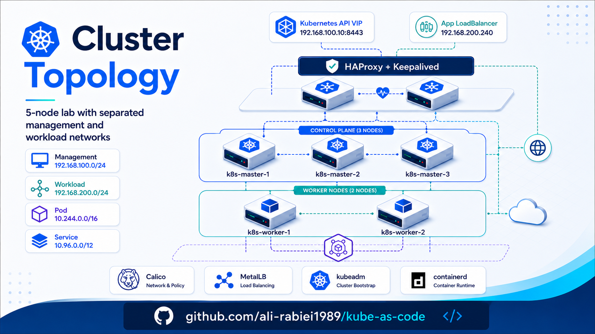

<p align="center">
  
</p>

# 03 - Installation Guide

This document explains how to deploy the Vagrant-based Kubernetes lab from a clean state. It covers VM provisioning, Ansible execution, and the first verification steps after installation.

> Main entry point: `ansible/site.yml`  
> Lab infrastructure entry point: `Vagrantfile`

---

## 1. Installation Flow

The installation is intentionally split into two layers:

```text
Vagrant
  |
  | creates VMs, NICs, hostnames, static IPs
  v
Virtual Machines
  |
  | configured by Ansible
  v
Kubernetes HA Lab
```

Vagrant is responsible for local lab infrastructure. Ansible is responsible for configuring the operating system, Kubernetes, networking, monitoring, the sample application, RBAC, and autoscaling.

This separation keeps the project cleaner and makes the Ansible code reusable outside Vagrant, for example on manually created VMs or cloud instances.

---

## 2. Expected Repository Structure

The repository is expected to look similar to this:

```text
Lab/
├── Vagrantfile
├── ansible/
│   ├── ansible.cfg
│   ├── inventory.ini
│   ├── group_vars/
│   │   └── all.yml
│   ├── roles/
│   └── site.yml
├── charts/
│   └── sample-webapp/
├── scripts/
└── docs/
```

The main Ansible playbook is:

```bash
ansible/site.yml
```

The sample application Helm chart is:

```bash
charts/sample-webapp
```

---

## 3. Provision the Virtual Machines

From the repository root, start the lab VMs:

```bash
vagrant up --provider=libvirt
```

If the environment uses VirtualBox instead of libvirt:

```bash
vagrant up --provider=virtualbox
```

The current lab design uses:

```text
3 control-plane nodes
2 worker nodes
```

Control-plane nodes run:

```text
- kube-apiserver
- kube-controller-manager
- kube-scheduler
- etcd
- HAProxy
- Keepalived
```

Worker nodes run application workloads.

---

## 4. Verify VM Availability

After Vagrant finishes, verify that all VMs are running:

```bash
vagrant status
```

Expected result:

```text
k8s-master-1   running
k8s-master-2   running
k8s-master-3   running
k8s-worker-1   running
k8s-worker-2   running
```

Then test SSH access:

```bash
vagrant ssh k8s-master-1
```

Exit the VM:

```bash
exit
```

---

## 5. Verify Ansible Inventory

Move into the Ansible directory:

```bash
cd ansible
```

Verify that Ansible can reach all nodes:

```bash
ansible all -m ping
```

Expected result:

```text
k8s-master-1 | SUCCESS
k8s-master-2 | SUCCESS
k8s-master-3 | SUCCESS
k8s-worker-1 | SUCCESS
k8s-worker-2 | SUCCESS
```

If this fails, check:

```text
- VM status
- SSH connectivity
- ansible/inventory.ini
- Vagrant-generated SSH keys
```

---

## 6. Run the Full Installation

From the `ansible/` directory, run:

```bash
ansible-playbook site.yml
```

This performs the complete installation:

```text
1. Prepare operating system settings
2. Install and configure containerd
3. Install kubeadm, kubelet, and kubectl
4. Configure HAProxy and Keepalived
5. Bootstrap Kubernetes control plane
6. Join worker nodes
7. Install Calico CNI
8. Install Helm
9. Install MetalLB
10. Deploy the sample application using Helm
11. Create the limited app-viewer user
12. Install Metrics Server
13. Install Prometheus
14. Install Prometheus Adapter
15. Configure HPA with custom metrics
```

---

## 7. Run Specific Installation Stages

The project supports Ansible tags for rerunning individual parts without reinstalling the entire cluster.

Examples:

```bash
ansible-playbook site.yml --tags sample_app
ansible-playbook site.yml --tags prometheus
ansible-playbook site.yml --tags prometheus_adapter
ansible-playbook site.yml --tags hpa
ansible-playbook site.yml --tags rbac
```

Common tags:

```text
common
containerd
kubernetes
kubernetes_images
ha
control_plane
worker
calico
helm
metallb
sample_app
rbac
metrics_server
prometheus
prometheus_adapter
hpa
```

Use tags when debugging or redeploying a specific component.

---

## 8. Verify Kubernetes Cluster Health

SSH into the first control-plane node:

```bash
vagrant ssh k8s-master-1
```

Verify node status:

```bash
kubectl get nodes -o wide
```

Expected result:

```text
k8s-master-1   Ready
k8s-master-2   Ready
k8s-master-3   Ready
k8s-worker-1   Ready
k8s-worker-2   Ready
```

Verify core Kubernetes pods:

```bash
kubectl get pods -n kube-system -o wide
```

Important components should be running:

```text
- CoreDNS
- Calico
- kube-apiserver
- kube-controller-manager
- kube-scheduler
- etcd
- metrics-server
```

---

## 9. Verify Kubernetes API High Availability

The Kubernetes API endpoint is exposed through Keepalived VIP and HAProxy running on the control-plane nodes.

Verify the VIP is reachable:

```bash
curl -k https://192.168.100.10:6443/version
```

Or use kubectl through the admin kubeconfig:

```bash
kubectl cluster-info
```

Check HAProxy service:

```bash
systemctl status haproxy
```

Check Keepalived service:

```bash
systemctl status keepalived
```

Check which control-plane node currently owns the VIP:

```bash
ip addr | grep 192.168.100.10
```

Run the command on all control-plane nodes. The VIP should appear on only one active node at a time.

---

## 10. Verify Calico CNI

Check Calico pods:

```bash
kubectl get pods -n calico-system -o wide
```

Or, depending on the installed Calico mode:

```bash
kubectl get pods -n kube-system | grep calico
```

Verify Pod-to-Pod networking:

```bash
kubectl run net-test-a --image=busybox:1.36 --restart=Never -- sleep 3600
kubectl run net-test-b --image=busybox:1.36 --restart=Never -- sleep 3600
kubectl get pods -o wide
```

Then test connectivity between Pod IPs:

```bash
kubectl exec net-test-a -- ping -c 3 <net-test-b-pod-ip>
```

Clean up:

```bash
kubectl delete pod net-test-a net-test-b
```

---

## 11. Verify MetalLB

Check MetalLB pods:

```bash
kubectl get pods -n metallb-system -o wide
```

Check MetalLB address pool:

```bash
kubectl get ipaddresspool -n metallb-system
kubectl get l2advertisement -n metallb-system
```

The sample application should receive a LoadBalancer IP from the workload network range:

```bash
kubectl get svc -n demo
```

Expected service:

```text
k8s-lab-sample-webapp   LoadBalancer   192.168.200.240
```

---

## 12. Verify Sample Application

The sample application is deployed using Helm with this naming convention:

```text
Helm release name: k8s-lab
Chart name:        sample-webapp
```

Therefore the main objects are named:

```text
Deployment:      k8s-lab-sample-webapp
Main Service:    k8s-lab-sample-webapp
Metrics Service: k8s-lab-sample-webapp-metrics
```

Check application resources:

```bash
kubectl get all -n demo -o wide
```

Expected pod status:

```text
READY   2/2
STATUS  Running
```

Each application Pod has two containers:

```text
- nginx
- nginx-prometheus-exporter
```

Test the application through MetalLB:

```bash
curl -i http://192.168.200.240/
curl -i http://192.168.200.240/healthz
curl -i http://192.168.200.240/readyz
```

Expected responses:

```text
/        -> 200 OK
/healthz -> ok
/readyz  -> ready
```

The `/metrics` endpoint is intentionally not exposed through the public LoadBalancer service.

---

## 13. Verify Application Metrics

Metrics are exposed through the internal metrics service:

```text
k8s-lab-sample-webapp-metrics.demo.svc.cluster.local:9113/metrics
```

Check the metrics service:

```bash
kubectl get svc -n demo k8s-lab-sample-webapp-metrics
```

Test exporter metrics from inside the cluster node:

```bash
METRICS_IP=$(kubectl -n demo get svc k8s-lab-sample-webapp-metrics -o jsonpath='{.spec.clusterIP}')
curl -s http://${METRICS_IP}:9113/metrics | grep nginx_http_requests_total
```

Expected metric:

```text
nginx_http_requests_total
```

---

## 14. Verify Metrics Server

Check Metrics Server:

```bash
kubectl get pods -n kube-system | grep metrics-server
kubectl get apiservice v1beta1.metrics.k8s.io
```

Verify resource metrics:

```bash
kubectl top nodes
kubectl top pods -A
```

If metrics are not immediately available, wait one or two minutes and retry.

---

## 15. Verify Prometheus

Check Prometheus:

```bash
kubectl get pods -n monitoring -o wide
kubectl get svc -n monitoring
```

Expected Prometheus pod status:

```text
prometheus-server-...   2/2   Running
```

Query the application metric:

```bash
PROM_IP=$(kubectl -n monitoring get svc prometheus-server -o jsonpath='{.spec.clusterIP}')

curl -s "http://${PROM_IP}/api/v1/query?query=nginx_http_requests_total" | jq
```

Query request rate:

```bash
curl -s "http://${PROM_IP}/api/v1/query?query=sum%28rate%28nginx_http_requests_total%7Bnamespace%3D%22demo%22%2Cservice%3D%22k8s-lab-sample-webapp%22%7D%5B2m%5D%29%29" | jq
```

---

## 16. Verify Prometheus Adapter

Check Prometheus Adapter:

```bash
kubectl get pods -n monitoring | grep prometheus-adapter
kubectl get apiservice v1beta1.custom.metrics.k8s.io
```

Expected APIService status:

```text
AVAILABLE=True
```

List custom metrics:

```bash
kubectl get --raw /apis/custom.metrics.k8s.io/v1beta1 | jq
```

Verify the Nginx request rate metric:

```bash
kubectl get --raw /apis/custom.metrics.k8s.io/v1beta1/namespaces/demo/services/k8s-lab-sample-webapp/nginx_http_requests_per_second | jq
```

Expected output type:

```text
MetricValueList
```

---

## 17. Verify HPA

Check the HPA object:

```bash
kubectl get hpa -n demo
kubectl describe hpa -n demo sample-webapp-hpa
```

Expected metric section:

```text
nginx_http_requests_per_second on Service/k8s-lab-sample-webapp
```

The HPA uses:

```text
metric type: Object
object:      Service/k8s-lab-sample-webapp
target:      AverageValue
```

The target is intentionally tuned for lab demonstration and should be changed for production.

---

## 18. Optional: Generate Load

A simple load test can be run from the host or from a control-plane node:

```bash
bash ./scripts/load-gen.sh start
```

Watch HPA and Deployment scaling:

```bash
watch -n 2 'kubectl get hpa -n demo; echo; kubectl get deploy -n demo k8s-lab-sample-webapp'
```

Stop the load generator:

```bash
bash ./scripts/load-gen.sh stop
```

After the load stops, HPA scale-down is delayed by its stabilization window.

---

## 19. Verify Limited RBAC User

A limited Kubernetes user is created for viewing application status and logs.

Expected kubeconfig path:

```bash
/opt/kubernetes/users/app-viewer/app-viewer.kubeconfig
```

Allowed actions:

```bash
sudo kubectl --kubeconfig=/opt/kubernetes/users/app-viewer/app-viewer.kubeconfig get pods -n demo
sudo kubectl --kubeconfig=/opt/kubernetes/users/app-viewer/app-viewer.kubeconfig get svc -n demo
sudo kubectl --kubeconfig=/opt/kubernetes/users/app-viewer/app-viewer.kubeconfig logs -n demo deploy/k8s-lab-sample-webapp --tail=20
```

Forbidden actions:

```bash
sudo kubectl --kubeconfig=/opt/kubernetes/users/app-viewer/app-viewer.kubeconfig get nodes
sudo kubectl --kubeconfig=/opt/kubernetes/users/app-viewer/app-viewer.kubeconfig delete pod -n demo <pod-name>
```

The forbidden commands should fail with an RBAC error.

---

## 20. Installation Success Criteria

The installation is considered successful when the following conditions are met:

```text
All nodes are Ready
Control-plane VIP is reachable
Calico is running
MetalLB assigns the application LoadBalancer IP
Sample application Pods are 2/2 Running
Application is reachable through 192.168.200.240
Metrics Server provides kubectl top output
Prometheus scrapes nginx_http_requests_total
Prometheus Adapter exposes nginx_http_requests_per_second
HPA reads the custom metric
Limited app-viewer user can view app status and logs only
```

---

## 21. Common Installation Commands

Full install:

```bash
cd ansible
ansible-playbook site.yml
```

Rerun sample application:

```bash
ansible-playbook site.yml --tags sample_app
```

Rerun Prometheus:

```bash
ansible-playbook site.yml --tags prometheus
```

Rerun Prometheus Adapter:

```bash
ansible-playbook site.yml --tags prometheus_adapter
```

Rerun HPA:

```bash
ansible-playbook site.yml --tags hpa
```

Rerun RBAC user creation:

```bash
ansible-playbook site.yml --tags rbac
```
