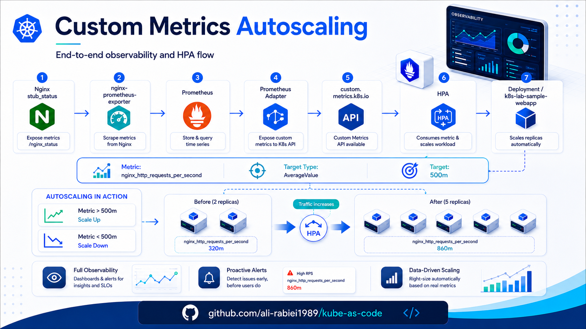

<p align="center">
  
</p>

# 07 - HPA with Custom Metrics

This document explains how Horizontal Pod Autoscaling is implemented using custom metrics in this Kubernetes lab.

The lab demonstrates autoscaling based on application request rate instead of only CPU or memory.

---

## 1. Goal

The goal is to scale the sample application based on HTTP request rate.

Instead of using only CPU or memory, the HPA uses this custom metric:

```text
nginx_http_requests_per_second
```

This metric is derived from Nginx request counters collected by Prometheus.

High-level flow:

```text
User / Load Generator
   |
   v
Nginx
   |
   v
nginx_http_requests_total
   |
   v
Prometheus rate query
   |
   v
Prometheus Adapter
   |
   v
custom.metrics.k8s.io
   |
   v
HorizontalPodAutoscaler
   |
   v
Deployment/k8s-lab-sample-webapp
```

---

## 2. Why Custom Metrics?

CPU-based autoscaling is useful, but it is not always enough.

Some applications need to scale based on business or application signals such as:

```text
HTTP request rate
request latency
queue length
number of active sessions
messages waiting in a broker
custom application workload counters
```

In this lab, the custom metric is HTTP request rate.

This is more meaningful than CPU for a web application demonstration because a low CPU Nginx workload may still receive many requests.

---

## 3. Metrics Server vs Prometheus Adapter

Metrics Server and Prometheus Adapter solve different problems.

| Component | API | Purpose |
|---|---|---|
| Metrics Server | `metrics.k8s.io` | CPU and memory metrics |
| Prometheus Adapter | `custom.metrics.k8s.io` | Application or custom metrics from Prometheus |

Metrics Server supports:

```bash
kubectl top nodes
kubectl top pods
```

Prometheus Adapter supports HPA metrics such as:

```text
nginx_http_requests_per_second
```

HPA cannot directly query Prometheus.  
It queries the Kubernetes metrics APIs.  
Prometheus Adapter acts as the bridge between Prometheus and Kubernetes HPA.

---

## 4. Application Metrics Source

The sample application is based on Nginx.

Nginx exposes internal status data through:

```text
127.0.0.1:8080/stub_status
```

The `nginx-prometheus-exporter` sidecar reads this endpoint and exposes Prometheus metrics on:

```text
:9113/metrics
```

Prometheus scrapes this internal Service:

```text
k8s-lab-sample-webapp-metrics.demo.svc.cluster.local:9113/metrics
```

Important raw metric:

```text
nginx_http_requests_total
```

This is a counter.

---

## 5. Why the Raw Counter Is Not Used Directly

The raw metric:

```text
nginx_http_requests_total
```

always increases.

It does not go down when traffic decreases.

For autoscaling, using this directly would be incorrect because the HPA would see an ever-growing value.

Instead, Prometheus converts the counter to a rate:

```promql
rate(nginx_http_requests_total[2m])
```

The Adapter exposes this rate as:

```text
nginx_http_requests_per_second
```

This value can increase when load increases and decrease when load stops.

---

## 6. Prometheus Query Used by the Adapter

The Adapter rule uses a query similar to:

```promql
sum(rate(nginx_http_requests_total{namespace="demo",service="k8s-lab-sample-webapp"}[2m])) by (namespace, service)
```

This calculates the request rate for the sample application Service.

The resulting custom metric is exposed as:

```text
nginx_http_requests_per_second
```

---

## 7. Why Service Object Metric Is Used

The Nginx exporter metric in this lab is associated with the metrics Service and includes these labels:

```text
namespace
service
```

It does not provide a clean per-Pod metric mapping for HPA.

Therefore, the HPA uses an Object metric attached to the Kubernetes Service:

```text
Service/k8s-lab-sample-webapp
```

This means the HPA watches the request rate of the application Service and uses it to scale the Deployment.

---

## 8. Object Metric vs Pod Metric

There are two common ways to use custom metrics with HPA:

```text
Pod metric:
  Metric is available per Pod.
  HPA calculates scaling based on per-Pod metric values.

Object metric:
  Metric is attached to a Kubernetes object such as a Service.
  HPA scales the target Deployment based on that object metric.
```

This lab uses:

```text
type: Object
object: Service/k8s-lab-sample-webapp
```

Because the request-rate metric is mapped to the Service.

---

## 9. HPA Manifest

The HPA scales:

```text
Deployment/k8s-lab-sample-webapp
```

using:

```text
Service/k8s-lab-sample-webapp
```

as the described object for the custom metric.

Example manifest:

```yaml
apiVersion: autoscaling/v2
kind: HorizontalPodAutoscaler
metadata:
  name: sample-webapp-hpa
  namespace: demo
spec:
  scaleTargetRef:
    apiVersion: apps/v1
    kind: Deployment
    name: k8s-lab-sample-webapp

  minReplicas: 3
  maxReplicas: 8

  metrics:
    - type: Object
      object:
        describedObject:
          apiVersion: v1
          kind: Service
          name: k8s-lab-sample-webapp
        metric:
          name: nginx_http_requests_per_second
        target:
          type: AverageValue
          averageValue: "500m"
```

---

## 10. Current HPA Parameters

The lab uses the following values:

```text
minReplicas: 3
maxReplicas: 8

metric: nginx_http_requests_per_second
target type: AverageValue
target average value: 500m
```

The value:

```text
500m
```

means:

```text
0.5 requests/second per replica
```

This is intentionally low for a lab so that scaling can be demonstrated with a small load generator.

In production, this value must be tuned using real benchmarking.

---

## 11. HPA Behavior

The lab configures explicit scale-up and scale-down behavior.

```yaml
behavior:
  scaleUp:
    stabilizationWindowSeconds: 0
    policies:
      - type: Percent
        value: 100
        periodSeconds: 15
      - type: Pods
        value: 2
        periodSeconds: 15
    selectPolicy: Max

  scaleDown:
    stabilizationWindowSeconds: 60
    policies:
      - type: Percent
        value: 50
        periodSeconds: 15
      - type: Pods
        value: 2
        periodSeconds: 15
    selectPolicy: Max
```

Meaning:

```text
Scale up quickly when load increases.
Scale down more carefully when load decreases.
```

Scale-down is intentionally slower to avoid flapping.

---

## 12. Timing Chain

Autoscaling does not happen instantly.

The signal passes through several stages:

```text
Nginx request count
   |
   v
Prometheus scrape interval
   |
   v
PromQL rate window
   |
   v
Prometheus Adapter relist/cache
   |
   v
HPA controller sync
   |
   v
Deployment scaling
```

Current lab timings:

```text
Prometheus scrape interval: 15s
PromQL rate window: 2m
Adapter relist interval: 30s
Adapter max age: 2m
HPA scale-down stabilization: 60s
```

Because the PromQL rate window is `2m`, traffic changes may take some time to be reflected fully.

---

## 13. Deploying the HPA

Run:

```bash
cd ansible
ansible-playbook site.yml --tags hpa
```

This renders and applies the HPA manifest from the Ansible role:

```text
ansible/roles/hpa/
```

---

## 14. Verify Custom Metrics API

Before checking HPA, verify that the custom metric exists.

List custom metrics:

```bash
kubectl get --raw /apis/custom.metrics.k8s.io/v1beta1 | jq
```

Expected:

```text
services/nginx_http_requests_per_second
```

Query the metric for the application Service:

```bash
kubectl get --raw /apis/custom.metrics.k8s.io/v1beta1/namespaces/demo/services/k8s-lab-sample-webapp/nginx_http_requests_per_second | jq
```

Expected:

```text
kind: MetricValueList
items: non-empty
```

---

## 15. Verify HPA Status

Check HPA:

```bash
kubectl get hpa -n demo
```

Describe HPA:

```bash
kubectl describe hpa -n demo sample-webapp-hpa
```

Expected healthy condition:

```text
ScalingActive=True
Reason=ValidMetricFound
```

Expected metric line:

```text
nginx_http_requests_per_second on Service/k8s-lab-sample-webapp
```

Example:

```text
1412m / 500m
```

This means:

```text
current average request rate: 1.412 requests/sec
target average request rate: 0.5 requests/sec
```

---

## 16. Generate Load

The repository provides a load generator script:

```text
scripts/load-test.sh
```

Start load:

```bash
WORKERS=10 APP_URL=http://192.168.200.240 ./scripts/load-test.sh start
```

Check status:

```bash
./scripts/load-test.sh status
```

Stop load:

```bash
./scripts/load-test.sh stop
```

---

## 17. Watch Autoscaling

Watch HPA and Deployment:

```bash
watch -n 2 'kubectl get hpa -n demo; echo; kubectl get deploy -n demo k8s-lab-sample-webapp'
```

During load, expected behavior:

```text
custom metric increases
desired replicas increase
Deployment scales above minReplicas
```

After stopping load, expected behavior:

```text
custom metric decreases after the Prometheus rate window
HPA waits for scale-down stabilization
Deployment gradually scales down
```

---

## 18. Stop Background Load

If load was started manually with curl loops, stop them:

```bash
pkill -f "curl.*192.168.200.240" || true
```

If load was started through the script:

```bash
./scripts/load-test.sh stop
```

Then wait for the metric pipeline to reflect the reduced load.

---

## 19. Check Direct Prometheus Query

If HPA is not behaving as expected, check Prometheus directly.

Get Prometheus Service IP:

```bash
PROM_IP=$(kubectl -n monitoring get svc prometheus-server -o jsonpath='{.spec.clusterIP}')
```

Query request rate:

```bash
curl -s "http://${PROM_IP}/api/v1/query?query=sum%28rate%28nginx_http_requests_total%7Bnamespace%3D%22demo%22%2Cservice%3D%22k8s-lab-sample-webapp%22%7D%5B2m%5D%29%29" | jq
```

If this value is high, HPA should scale up.

If this value is low but HPA is still high, wait for the scale-down stabilization window.

---

## 20. Common Issues

### HPA shows `<unknown>`

Check:

```bash
kubectl get --raw /apis/custom.metrics.k8s.io/v1beta1/namespaces/demo/services/k8s-lab-sample-webapp/nginx_http_requests_per_second | jq
```

If this fails, the problem is in Prometheus Adapter or Prometheus.

### Custom metric not listed

Check:

```bash
kubectl get apiservice v1beta1.custom.metrics.k8s.io
kubectl logs -n monitoring deploy/prometheus-adapter --tail=100
```

Common causes:

```text
Prometheus is down
Adapter rule mismatch
missing namespace/service labels
metrics-max-age too short
wrong Service name
```

### HPA scales to max replicas without manual load

Possible causes:

```text
background load generator is still running
target value is too low
probe traffic contributes to Nginx request count
Prometheus rate window still contains old traffic
```

Check for background curl processes:

```bash
pgrep -af "curl.*192.168.200.240"
```

Stop them:

```bash
pkill -f "curl.*192.168.200.240" || true
```

### HPA does not scale down immediately

This is expected.

Reasons:

```text
Prometheus rate window still includes previous traffic
Adapter cache updates periodically
HPA scale-down stabilization delays downscaling
```

Current lab scale-down stabilization:

```text
60 seconds
```

---

## 21. Tuning Guidelines

### Lab tuning

For fast demonstration:

```text
scrape_interval: 15s
rate window: 2m
adapter relist interval: 30s
scaleDown stabilization: 60s
target average value: 500m
```

### Production tuning

For production, use more conservative values:

```text
scrape_interval: 30s or 60s
rate window: 2m to 5m
scaleDown stabilization: 300s or more
target value based on real load testing
maxReplicas based on capacity planning
```

Avoid very short windows in production because they can cause noisy scaling behavior.

---

## 22. Security Considerations

The custom metric is derived from an internal metrics Service.

```text
Metrics Service:
k8s-lab-sample-webapp-metrics
Type: ClusterIP
Port: 9113
```

It is not exposed through the public LoadBalancer.

This prevents external users from accessing operational metrics directly.

For production, add NetworkPolicies so only Prometheus can access metrics endpoints.

---

## 23. Summary

The lab implements HPA with custom metrics using this chain:

```text
Nginx
   |
   v
nginx-prometheus-exporter
   |
   v
Prometheus
   |
   v
Prometheus Adapter
   |
   v
custom.metrics.k8s.io
   |
   v
HPA
   |
   v
Deployment/k8s-lab-sample-webapp
```

The HPA scales the application based on:

```text
nginx_http_requests_per_second
```

attached to:

```text
Service/k8s-lab-sample-webapp
```

This demonstrates application-aware autoscaling beyond basic CPU and memory metrics.
